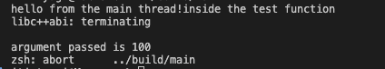

# Concurrency
Concurrency is a topic misunderstood in so many discussions. Adding a small repo which is going to help with some basic step by step examples.

<code>
Error like this will come since main thread and new thread have no idea what to plan as a sequence and concurrency is all about sequence
</code>

<code>

void test (int x) {
    std::cout << "inside the test function" << std::endl;
    std::cout << "argument passed is " << x << std::endl;
}

int main() {
    std::thread mythread(&test, 100);
    std::cout <<"hello from the main thread!" <<std::endl;
    return 0;
}
</code>

